# Cway Academy - Online Learning Management System

[](https://opensource.org/licenses/MIT)
[](https://nodejs.org/)
[](https://www.mongodb.com/)

A comprehensive MERN stack learning management system designed for modern educational institutions. Features interactive quizzes, real-time discussions, automated certificate generation, and advanced analytics.

## 🌟 Key Features

### 📚 Comprehensive LMS Features
- **Role-Based Access Control**: Student, Tutor, and Admin roles with granular permissions
- **Interactive Course Management**: Create, organize, and deliver multi-section courses
- **Advanced Quizzing System**: Multiple choice, multiple answer, and true/false questions
- **Real-Time Discussions**: Socket.IO-powered chat rooms for collaborative learning
- **Progress Tracking**: Detailed student progress monitoring and completion tracking
- **README.md Course Creation**: Teachers can create courses directly from README.md files

### 🎯 Interactive Learning Tools
- **Live Polls**: Real-time polling during lessons for engagement
- **Certificate Generation**: Automated PDF certificates with QR code verification
- **Gamification**: Badge system and leaderboards for motivation
- **Video Lessons**: Integrated video player with timestamp support

### 📊 Analytics & Insights
- **Comprehensive Dashboard**: Detailed analytics for tutors and administrators
- **Performance Metrics**: Student progress, quiz scores, and engagement statistics
- **System Analytics**: Platform-wide usage and performance monitoring

## 🛠️ Tech Stack

### Frontend
- **React 18** with Vite for fast development and building
- **Material-UI (MUI)** for modern, accessible component library
- **React Query** for efficient server state management
- **Zustand** for lightweight client-side state management
- **Socket.IO Client** for real-time communication
- **React Player** for video playback integration
- **Chart.js** for data visualization
- **React Router** for client-side routing

### Backend
- **Node.js** with Express.js framework
- **MongoDB** with Mongoose ODM
- **Socket.IO** for real-time bidirectional communication
- **JWT** for secure authentication and authorization
- **PDFKit** for certificate generation
- **Multer** for file upload handling

### Development & Deployment
- **ESLint** for code quality and consistency
- **Jest** for unit testing
- **Husky** for Git hooks
- **Prettier** for code formatting
- **Docker** support for containerized deployment

## 🏛️ System Architecture

```mermaid
graph TB
    %% User Layer
    subgraph "Users"
        Student[👨‍🎓 Student]
        Tutor[👨‍🏫 Tutor]
        Admin[👑 Admin]
    end

    %% Frontend Layer
    subgraph "Frontend (React + Vite)"
        React[⚛️ React 18<br/>SPA Application]
        MUI[🎨 Material-UI<br/>Components]
        Zustand[📦 Zustand<br/>State Management]
        RQ[🔄 React Query<br/>Data Fetching]
        SocketClient[🔌 Socket.IO Client<br/>Real-time]
    end

    %% Backend Layer
    subgraph "Backend (Node.js + Express)"
        Express[🚀 Express.js<br/>API Server]
        Auth[🔐 JWT Auth<br/>Middleware]
        Routes[🛣️ API Routes<br/>Controllers]
        SocketServer[🔌 Socket.IO Server<br/>Real-time]
        Cert[📜 PDFKit<br/>Certificates]
    end

    %% External Services
    subgraph "External Services"
        Email[📧 Nodemailer<br/>Email Service]
    end

    %% Data Layer
    subgraph "Data Layer"
        MongoDB[(📊 MongoDB<br/>Database)]
        FileStorage[💾 File Storage<br/>Media/Certificates]
    end

    %% Connections
    Student --> React
    Tutor --> React
    Admin --> React

    React --> RQ
    React --> SocketClient
    React --> MUI
    React --> Zustand

    RQ --> Express
    SocketClient --> SocketServer

    Express --> Auth
    Express --> Routes
    Express --> SocketServer
    Routes --> Cert

    Routes --> MongoDB
    Cert --> MongoDB

    Cert --> FileStorage
    Routes --> FileStorage

    Routes --> Email

    %% Styling
    classDef frontend fill:#e1f5fe,stroke:#01579b,stroke-width:2px
    classDef backend fill:#f3e5f5,stroke:#4a148c,stroke-width:2px
    classDef external fill:#fff3e0,stroke:#e65100,stroke-width:2px
    classDef data fill:#e8f5e8,stroke:#1b5e20,stroke-width:2px
    classDef users fill:#fce4ec,stroke:#880e4f,stroke-width:2px

    class React,MUI,Zustand,RQ,SocketClient frontend
    class Express,Auth,Routes,SocketServer,Cert backend
    class Email external
    class MongoDB,FileStorage data
    class Student,Tutor,Admin users
```



### Architecture Overview

**🏗️ Multi-Tier Architecture:**
- **Presentation Layer**: React SPA with Material-UI components
- **Application Layer**: Express.js API server with business logic
- **Data Layer**: MongoDB with Mongoose ODM and file storage

**🔄 Real-Time Communication:**
- Socket.IO enables live discussions, polling, and instant messaging
- Bidirectional communication between client and server

**🔒 Security & Authentication:**
- JWT-based authentication with refresh tokens
- Role-based access control (Student/Tutor/Admin)
- Helmet.js for security headers

**📊 Data Flow:**
1. Users interact with React frontend
2. API requests handled by Express routes
3. Business logic processed by controllers
4. Data persisted in MongoDB
5. Real-time events broadcast via Socket.IO

## 🚀 Quick Start

### Prerequisites
- **Node.js** 18.0.0 or higher
- **MongoDB** 4.4 or higher (local installation or MongoDB Atlas)
- **npm** or **yarn** package manager
- **Git** for version control

### Installation

1. **Clone the Repository**
   ```bash
   git clone https://github.com/Joelrtharakan/Cway-Academy-Online-Learning-Hub.git
   cd Cway-Academy-Online-Learning-Hub
   ```

2. **Install Dependencies**
   ```bash
   # Install all workspace dependencies
   npm install
   ```

3. **Environment Configuration**

   Create environment files for both client and server:

   ```bash
   # Client environment variables
   cp client/.env.example client/.env

   # Server environment variables
   cp server/.env.example server/.env
   ```

   **Required Server Environment Variables:**
   ```env
   # Database
   MONGODB_URI=mongodb://localhost:27017/cway-academy

   # Authentication
   JWT_SECRET=your-super-secret-jwt-key-here
   JWT_REFRESH_SECRET=your-super-secret-refresh-key-here

   # Server Configuration
   PORT=4000
   CLIENT_URL=http://localhost:5173
   ```

4. **Database Setup**
   ```bash
   # Seed the database with sample data
   npm run seed
   ```

5. **Start Development Servers**
   ```bash
   # Start both client and server concurrently
   npm run dev
   ```

   The application will be available at:
   - **Frontend**: http://localhost:5173
   - **Backend API**: http://localhost:4000

## 👥 Demo Accounts

After running the seed script, use these accounts to explore the platform:

| Role    | Email                  | Password    | Description |
|---------|------------------------|-------------|-------------|
| Admin   | admin@cway.ac         | P@ssw0rd!  | Full system access |
| Tutor   | tutor.ai@cway.ac      | P@ssw0rd!  | Course content creation |
| Tutor   | tutor.math@cway.ac    | P@ssw0rd!  | Mathematics courses |
| Student | ali.student@cway.ac   | P@ssw0rd!  | Regular student |
| Student | rina.student@cway.ac  | P@ssw0rd!  | Active learner |
| Student | dev.student@cway.ac   | P@ssw0rd!  | Developer student |

## 📖 Usage Guide

### For Students
1. **Registration/Login**: Create an account or use demo credentials
2. **Browse Courses**: Explore available courses by category
3. **Enroll & Learn**: Enroll in courses and access video lessons
4. **Take Quizzes**: Complete interactive quizzes with auto-grading
5. **Earn Certificates**: Download verified certificates upon completion
6. **Participate**: Join discussions and engage with peers

### For Tutors
1. **Create Courses**: Build courses manually or import from README.md files
2. **Manage Content**: Add sections, lessons, and quiz questions
3. **Monitor Progress**: Track student enrollment and completion
4. **View Analytics**: Access detailed course and student performance data

### For Administrators
1. **System Overview**: Monitor platform-wide statistics
2. **User Management**: Manage users, roles, and permissions
3. **Content Moderation**: Oversee courses and user-generated content
4. **Analytics Access**: View comprehensive system analytics

## 🔌 API Documentation

### Authentication Endpoints
```http
POST /api/auth/register
POST /api/auth/login
POST /api/auth/refresh
GET  /api/auth/me
POST /api/auth/logout
```

### Course Management
```http
GET    /api/courses              # List courses with pagination
GET    /api/courses/:id          # Get course details
POST   /api/courses              # Create course (Tutor/Admin)
PUT    /api/courses/:id          # Update course
DELETE /api/courses/:id          # Delete course
POST   /api/courses/:id/enroll   # Enroll in course
```

### Quiz System
```http
GET    /api/quizzes/:id                    # Get quiz questions
POST   /api/quizzes/:id/attempts           # Start quiz attempt
PATCH  /api/attempts/:id/submit            # Submit quiz answers
GET    /api/attempts/:id/results           # Get attempt results
```

### Real-Time Features (Socket.IO)
```javascript
// Join discussion room
socket.emit('join_room', { roomId: 'course-123' });

// Send message
socket.emit('new_message', { roomId: 'course-123', text: 'Hello!' });

// Live polling
socket.emit('live_poll_create', { courseId: '123', question: 'Q?', options: ['A', 'B'] });
socket.emit('live_poll_vote', { pollId: '456', optionKey: 'A' });
```

### Analytics
```http
GET /api/analytics/course/:id     # Course analytics (Tutor/Admin)
GET /api/analytics/system         # System analytics (Admin)
GET /api/analytics/student/:id    # Student analytics
```

### Certificates
```http
POST /api/certificates            # Generate certificate
GET  /api/certificates/verify/:code # Verify certificate authenticity
```

## 🏗️ Project Structure

```
Cway-Academy-Online-Learning-Hub/
├── client/                      # React Frontend Application
│   ├── public/                  # Static assets
│   ├── src/
│   │   ├── components/          # Reusable UI components
│   │   │   ├── CourseViewer.jsx
│   │   │   └── Layout.jsx
│   │   ├── pages/              # Page components
│   │   │   ├── CourseGenerator.jsx
│   │   │   ├── AnalyticsDashboard.jsx
│   │   │   ├── Certificates.jsx
│   │   │   ├── CoursePlayer.jsx
│   │   │   └── Dashboard.jsx
│   │   ├── context/            # React context providers
│   │   ├── store/              # Zustand state stores
│   │   ├── services/           # API and socket services
│   │   ├── utils/              # Utility functions
│   │   ├── theme.js            # Material-UI theme configuration
│   │   └── App.jsx             # Main application component
│   ├── package.json
│   └── vite.config.js
├── server/                      # Node.js Backend API
│   ├── src/
│   │   ├── config/             # Database and configuration
│   │   ├── controllers/        # Route controllers
│   │   │   ├── contentController.js
│   │   │   └── courseController.js
│   │   ├── middleware/         # Authentication and validation
│   │   ├── models/             # Mongoose data models
│   │   ├── routes/             # API route definitions
│   │   ├── services/           # External service integrations
│   │   ├── utils/              # Helper utilities
│   │   └── index.js            # Server entry point
│   ├── storage/                # File uploads and media
│   ├── package.json
│   └── scripts/                # Database seeding scripts
├── package.json                # Workspace configuration
├── requirements.txt            # Python dependencies (if needed)
├── check_mongodb.py           # MongoDB connection checker
└── README.md                  # This file
```

## 🧪 Testing

```bash
# Run all tests across workspaces
npm run test

# Run client tests only
cd client && npm run test

# Run server tests only
cd server && npm run test

# Run tests with coverage
npm run test -- --coverage
```

## 🎨 Development

### Code Quality
```bash
# Run linting across all workspaces
npm run lint

# Format code with Prettier
npx prettier --write .
```

### Building for Production
```bash
# Build client for production
cd client && npm run build

# Build server for production
cd server && npm run build
```

### Docker Deployment (Optional)
```bash
# Build and run with Docker Compose
docker-compose up --build

# Run in detached mode
docker-compose up -d --build
```

## 🔧 Configuration

### Environment Variables Reference

#### Client (.env)
```env
VITE_API_URL=http://localhost:4000
VITE_SOCKET_URL=http://localhost:4000
VITE_APP_NAME=Cway Academy
```

#### Server (.env)
```env
# Server Configuration
PORT=4000
NODE_ENV=development
CLIENT_URL=http://localhost:5173

# Database
MONGODB_URI=mongodb://localhost:27017/cway-academy

# Authentication
JWT_SECRET=your-256-bit-secret-key
JWT_REFRESH_SECRET=your-256-bit-refresh-secret
JWT_EXPIRES_IN=15m
JWT_REFRESH_EXPIRES_IN=7d

# Email Service (Optional)
EMAIL_HOST=smtp.gmail.com
EMAIL_PORT=587
EMAIL_USER=your-email@gmail.com
EMAIL_PASS=your-app-password

# File Upload
MAX_FILE_SIZE=10485760
UPLOAD_PATH=./storage/media
```

## 🤝 Contributing

We welcome contributions! Please follow these steps:

1. **Fork the Repository**
2. **Create a Feature Branch**
   ```bash
   git checkout -b feature/amazing-feature
   ```
3. **Make Your Changes**
4. **Add Tests** for new features
5. **Run Quality Checks**
   ```bash
   npm run lint
   npm run test
   ```
6. **Commit Your Changes**
   ```bash
   git commit -m 'Add amazing feature'
   ```
7. **Push to Branch**
   ```bash
   git push origin feature/amazing-feature
   ```
8. **Open a Pull Request**

### Development Guidelines
- Follow ESLint configuration
- Write meaningful commit messages
- Add tests for new features
- Update documentation as needed
- Ensure all tests pass before submitting PR

## 📄 License

This project is licensed under the MIT License - see the [LICENSE](LICENSE) file for details.

## 🙏 Acknowledgments

- **Material-UI** for the beautiful component library
- **Socket.IO** for real-time communication
- **MongoDB** for reliable data storage

## 📞 Support

For support, email support@cway.academy or join our [Discord community](https://discord.gg/cway-academy).

---

**Built with ❤️ for modern education**